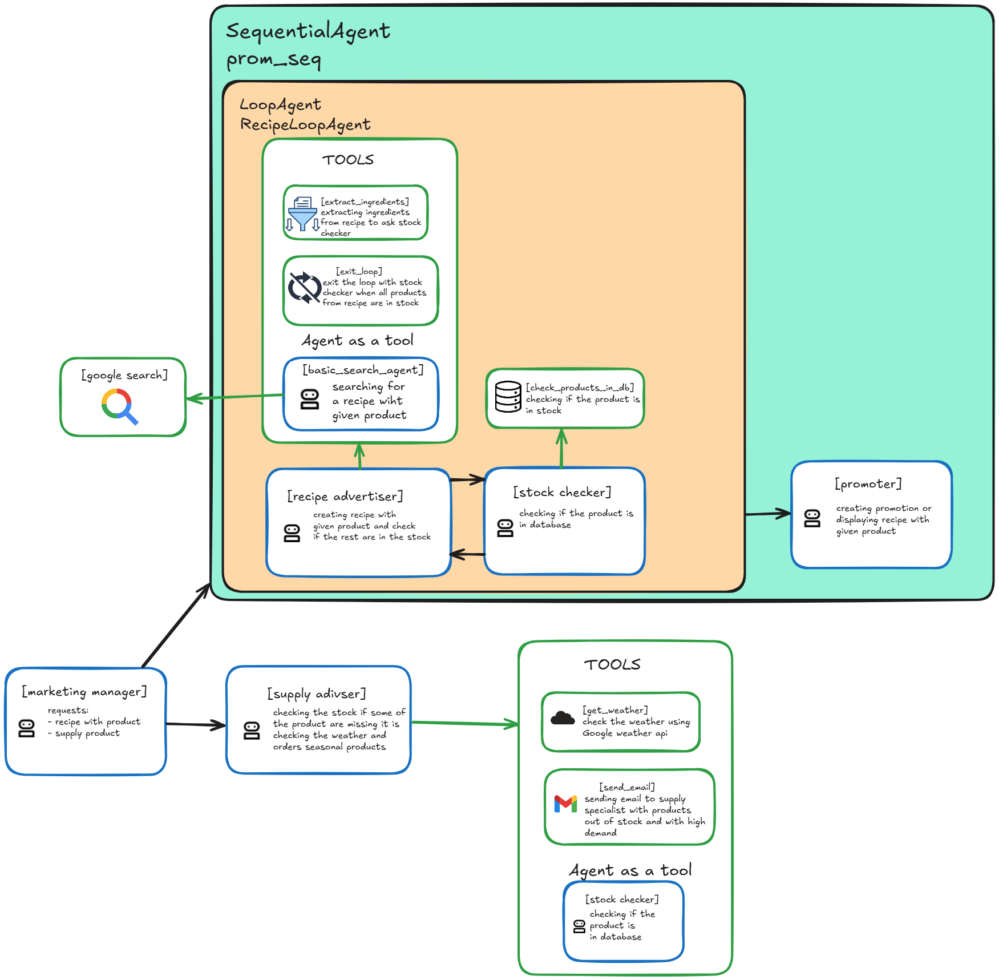

# Agentowy Chrząszcz Trzcinowy

AI Agents for greater good.

## Use case
### Autonomous Store Optimization
In-store performance is still largely driven by static planning and manual execution—resulting in missed sales, inefficient labor, and poor responsiveness to shopper behavior. Traditional merchandising and pricing systems can't keep up with real-time signals from cameras, sensors, and digital touchpoints. This use case introduces a multi-agent system that coordinates across pricing, layout, inventory, and labor management to dynamically adapt the store environment based on live inputs—maximizing conversion and customer satisfaction while minimizing operational waste.
#### Parameters
- Monitor foot traffic, POS, and Wi-Fi data to detect demand shifts in real time.
- Adjust product displays, signage, and screen content based on traffic patterns.
- Reposition underperforming products based on consumer engagement.
- Dynamically update digital shelf labels and prices to match competitors.
- Launch targeted promotions based on time, inventory, and sales performance.
- Detect low-shelf stock using cameras or sensors and trigger restocking tasks.
- Reassign staff based on queue length, traffic surges, and replenishment urgency.
- Coordinate with robotic shelving or push layout guidance to mobile devices.
- Deliver AI concierge experiences via smart displays and mobile apps.
- Personalize product suggestions and offers based on loyalty behavior.

## Ideas
Convenience based shop management system based on AI Agents. Except standard food store (whatever size it is) stuff system is focused on giving solutions like recipes with list of products which are currently available in the shop. Or advices that it'll be warm next few days and there are suitable products in the shop or what to order to have proper supplies.

Roles:
- General goods management (orders, deliveries, shelving, stock monitoring etc.).
- Price management (based on sales and stocks)

## Solution
System is build as a conglomerate of various items which communicate with others via event loop. Some of items are sending messages only (sensors, cameras, etc.), some receives messages only (displays, robots, etc.) and some receives and sends messages (Agencies which are multi-agent autonomous subsystems). The main purpose of such a approach is scalability and flexibility. It is easy to add new senders and receivers. It is especially useful for adding new agencies, for example the second Supply Coordinator agency when one is overwhelmed with tasks or brand new agency for new tasks.

## Components

The main components of the Store Management System:
- Cloud of IoT devices like shelf sensors, cameras with image analysis (counting people), cash registers, traffic counters etc.
- Main agents (Agency coordinators):
  - Store Manager - responsible for store management,
  - Supply Coordinator - responsible for store inventory,
  - Marketing Manager - responsible for promotions, sales predictions, price management,
  - Customer Service Manager - responsible for personalized offers, pricing etc.,
  - Workforce Coordinator - responsible for agent deployment (adding/removing groups of agents if needed).
- Cloud of marketing devices like shelf labels, displays, mobile app, website, employee handhelds, guide robots, etc.
- Workforce: employees, agents and robots (shelving, cleaning, guides).

## Agents
Grouped by agencies.

### Store Manager

### Supply Coordinator

### Marketing Manager

### Customer Service Manager

### Workforce Coordinator

### LLM
- Recipe Agent - bierze zalegające produkty, szuka przepisów, w których można je wykorzystać, sprawdza czy w sklepie są pozostałe potrzebne produkty, wybiera najlepusze przepisy i wysyła do Agenta Reklamiarza
- Planner Agent - bierze prognozę pogody od agenta Synoptyka, sprawdza co będzie się dobrze sprzedawało i wysyła listę do agenta Zaopatrzeniowca
- Marketing Agent - preparation of materials to be displayed on screens (i.e. recipe with picture, list of products with locations in the shop, recipe itself and QR-code linking to webpage with details).

### Tool
- kasa, półka, magazyn, ludzie,
- Agent Półkowy - wysyła zlecenia uzupełnienia stanu na półce

## Flows
### Marketing Manager Agent
Marketing Manager Agent (MMA) reads messages from BUS. If message is sent to it Agent reads it and decides what to do next. There are some possibilities:
- calling Receipe Advertiser Agent (RAA) to prepare recipe with given product,
- calling Supply Advisor Agent for future demand ideas,
- calling other agents if available.

Message for Marketing Manager Agent may contain messages like:
- there is a slow rotating product,
- sessony product is sold,
- product supply advisory required,
- and so on.

Marketing Manager Agent reads a message and decides what to do next. In the case of slow rotating product flow looks like this:
- MMA calls RAA with message: prepare recipe with product,
- RAA starts loop with Recipe Finder Agent and Stock Check Agent,
- Recepie Finder Agent looks for recipe with products and send it to Stock Check Agent,
- Stock Check Agent checks for products availability and sends recipe with stock availability to RAA,
- if all products are available RAA sends recipe to MMA or to BUS directly addressing it to Displays, Mobile App and Website,
- if not all products are available RAA sends request to Recipe Finder Agent to find recipe with given product and without unavailable products,
- loop is repeated until success or is interupted if there is no recepie found after i.e. 3 loops,
- if no recipe is found RAA calls MMA with no recipe message,
- MAA calls Promotion Agent to prepare advertisement to sell given product.
