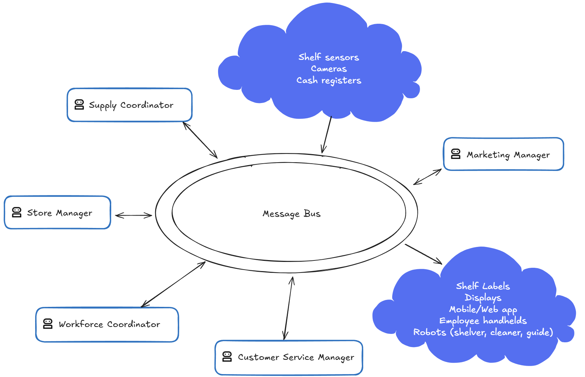
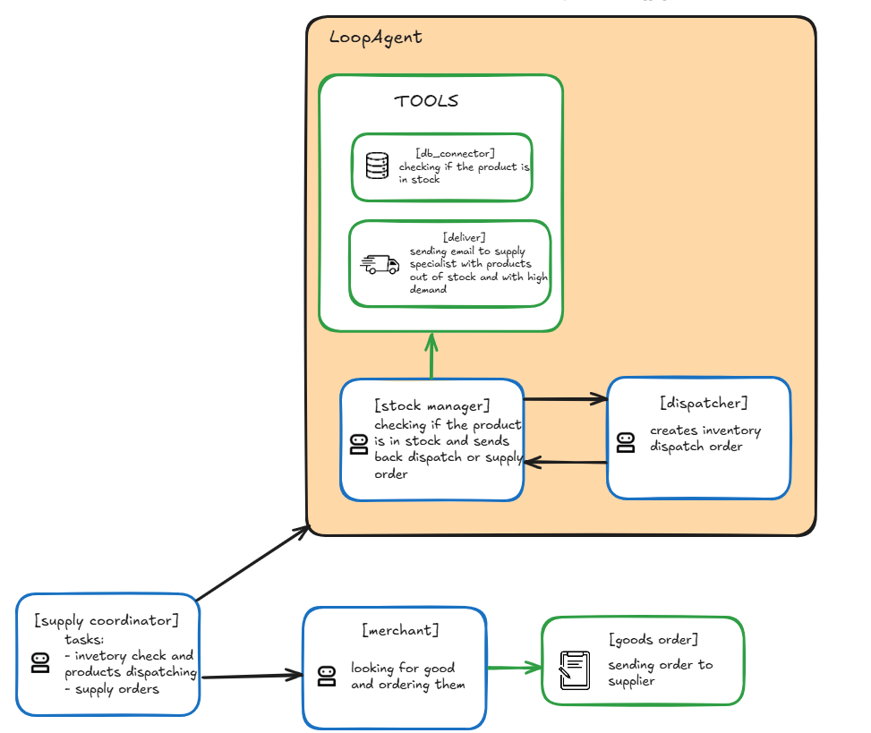

# Agentowy Chrząszcz Trzcinowy

AI Agents for greater good.

## Use case
### Autonomous Store Optimization
In-store performance is still largely driven by static planning and manual execution—resulting in missed sales, inefficient labor, and poor responsiveness to shopper behavior. Traditional merchandising and pricing systems can't keep up with real-time signals from cameras, sensors, and digital touchpoints. This use case introduces a multi-agent system that coordinates across pricing, layout, inventory, and labor management to dynamically adapt the store environment based on live inputs—maximizing conversion and customer satisfaction while minimizing operational waste.
#### Parameters
- Monitor foot traffic, POS, and Wi-Fi data to detect demand shifts in real time.
- Adjust product displays, signage, and screen content based on traffic patterns.
- Reposition underperforming products based on consumer engagement.
- Dynamically update digital shelf labels and prices to match competitors.
- Launch targeted promotions based on time, inventory, and sales performance.
- Detect low-shelf stock using cameras or sensors and trigger restocking tasks.
- Reassign staff based on queue length, traffic surges, and replenishment urgency.
- Coordinate with robotic shelving or push layout guidance to mobile devices.
- Deliver AI concierge experiences via smart displays and mobile apps.
- Personalize product suggestions and offers based on loyalty behavior.

## Ideas
- Fully autonomous store management system based on multiple independent multi-agent apps (subsystems).
- Communication between devices, apps and humans is conducted via universal message bus.
- There are three groups of actors:
  - Inputs - sensors, cameras, etc. - sending messages to bus,
  - Outputs - displays, labels, mobile/web apps, worker handhelds, robots, etc. - receiving messages from bus,
  - Agencies - multi-agentic apps playing various roles in store management system (supply, promotion, price management, etc.).
- Each actor and its parts can be replaced/upgraded without disturbing store work.
- Message bus is queue like and actors communicate via channels they are subscribed to.
- System is scalable - additional actors can be added:
  - it is possible to deploy multiple Agencies of the same type to work simultaneously when more workforce is required,
  - it is possible to add new type of Agency to add new functionality,
  - it is possible to add new or more Inputs and Outputs if needed.
- Adding new features do not disturb store work.

## Solution
To address assumptions and ideas few decisions were made:
- each actor is independent and communicate only with well addressed message recipients,
- message bus offers channels with subscriptions and message queueing,
- disruption in actor's work engages users of its communication channel only,
- not read messages are redirected to selected actor after given time,
- it is possible to add human-in-the-loop for Agencies for semi autonomous store management.

System is a conglomerate of various items which communicate with others via Message Bus. Some of items are sending messages only (sensors, cameras, etc.), some receives messages only (displays, robots, etc.) and some receives and sends messages (Agencies). The main purpose of such a approach is scalability and flexibility. It is easy to add new senders and receivers. It is especially useful for adding new Agencies, for example the second Supply Coordinator agency when one is overwhelmed with tasks or brand new agency for new tasks.

Communication between actors is conducted via Message Bus. Each actor is subscribed to a channel. Sender publishes  message (JSON object) to its channel and all subscribers are informed. The first interested subscriber picks up the message and processes it. Dedicated agent (Workforce Coordinator) analyzes constantly traffic in Message Bus to ballance work nd minimize message queue.

## Components

The main components of the Store Management System:
- Cloud of IoT devices like shelf sensors, cameras with image analysis (counting people), cash registers, traffic counters etc.
- Main agents (Agency coordinators):
  - Store Manager - responsible for store management,
  - Supply Coordinator - responsible for store inventory,
  - Marketing Manager - responsible for promotions, sales predictions, price management,
  - Customer Service Manager - responsible for personalized offers, pricing etc.,
  - Workforce Coordinator - responsible for agent deployment (adding/removing groups of agents if needed).
- Cloud of marketing devices like shelf labels, displays, mobile app, website, employee handhelds, guide robots, etc.
- Workforce: employees, agents and robots (shelving, cleaning, guides).

## Agents
Grouped by agencies.

### Store Manager
Store Manager Agency is responsible for:
- inventory analysis and orders management (approval),
- cash management,
- shelving improvements (i.e. changes in product placements to easy customer traffic),
- store maintenance (i.e. sending cleaning robots),
- etc.

### Supply Coordinator

Supply Coordinator Agency is responsible for:
- product replenishment on shelves,
- orders for running out and sold products,
- deliveries acceptance,
- etc.

### Marketing Manager

Marketing Manager Agency is responsible for:
- creation of promotions,
- creation of recipes to sell stockpiling goods,
- products sales forecasts,
- new price calculations,
- etc.

### Customer Service Manager
Customer Service Manager Agency is responsible for:
- personal offers,
- customer claims management,
- etc.

### Workforce Coordinator
Workforce Coordinator Agency is responsible for:
- message bus monitoring,
- deployment and removal of Agencies,
- workforce management,
- etc.

## Flows
Selected flows in store management system.

### Marketing Manager Agent
Marketing Manager Agent (MMA) reads messages from message bus and decides what to do next. There are some possibilities:
- calling Recipe Advertiser Agent (RAA) to prepare recipe with given product,
- calling Supply Advisor Agent for future demand ideas,
- calling Promotion Agent to prepare promotion and design advertisement,
- calling other agents if available.

Message addressed to MMA may contain messages like:
- there is a slow rotating product,
- seasonal product is sold,
- product supply advisory required,
- and so on.

MMA reads a message and decides what to do next. In the case of slow rotating product flow looks like:
- MMA calls RAA with message: prepare recipe with product,
- RAA starts loop with Recipe Finder Agent and Stock Check Agent,
- Recipe Finder Agent looks for recipe with products and send it to Stock Check Agent,
- Stock Check Agent checks for products availability and sends recipe with stock availability to RAA,
- if all products are available RAA sends recipe to MMA or to message bus directly addressing it to selected Outputs (Displays, Guide Robots, Mobile App and Website),
- if not all products are available RAA sends request to Recipe Finder Agent to find recipe with given product and without unavailable products,
- loop is repeated until success or is interrupted if there is no recipe found after i.e. 3 loops,
- if no recipe is found RAA calls MMA with no recipe message,
- MMA calls Promotion Agent to prepare advertisement to sell given product.
- Promotion Agent prepares promotion and send it back to MMA.
- MMA sends message with promotion to selected Outputs.

### Supply Coordinator Agent
Supply Coordinator Agent (SCA) reads messages from message bus and decides what to do next:
- calling Stock Manager Agent (SMA) to check for stock,
- calling Merchant Agent to order goods,
- calling other agents if available.

Message addressed to SCA may contain messages like:
- there is shortage of product on a shelf,
- there are products to be ordered,
- and so on.

SCA reads the message and decides what to do next.
- In case of shelf product shortage:
  - SCA calls SMA with message: replenish the product on the shelf,
  - SMA checks if product is in the stock:
    - if yes, SMA calls Dispatcher Agent, which sends order to shelving robot or employee handheld to get goods from stock and put in on the shelve,
    - if not, SMA calls Merchant Agent to order goods,
- In case of goods to be ordered:
  - SCA calls Merchant Agent to order goods,
  - when goods are delivered SCA accepts them.
- On regular basis SCA gets messages from Marketing Manager Agent about new goods to be ordered.
